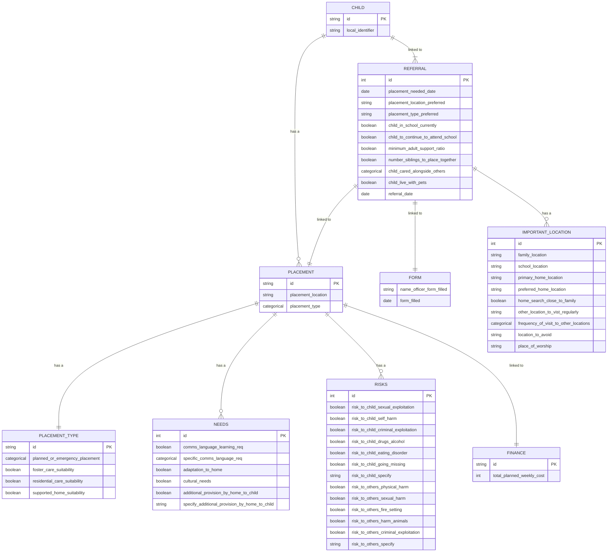

# sw-sufficiency-model   (version v1)

#### This entity relationship diagram (ERD) represents the proposed data collection method for the Southwest Sufficiency Project, which aims to standardize children's data collection across the region. Additionally, this ERD can serve as a framework to link with data collected by other local authorities, fostering collaboration and consistency in data management practices across the region.

