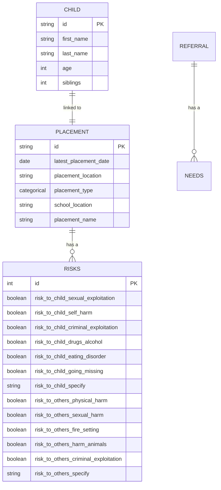

# placement-agreement-data-collection

```mermaid
erDiagram
    CHILD ||--|| PLACEMENT : "linked to"
    PLACEMENT ||--o{ RISKS : "has a"
    REFERRAL ||--o{ NEEDS : "has a"
    CHILD {
        string id PK
        string first_name
        string last_name
        int age
        int siblings
    }
    PLACEMENT {
        string id PK
        date latest_placement_date
        string placement_location
        categorical placement_type
        string school_location
        string placement_name
    }
    RISKS {
        int id PK
        boolean risk_to_child_sexual_exploitation
        boolean risk_to_child_self_harm
        boolean risk_to_child_criminal_exploitation
        boolean risk_to_child_drugs_alcohol
        boolean risk_to_child_eating_disorder
        boolean risk_to_child_going_missing
        string risk_to_child_specify
        boolean risk_to_others_physical_harm
        boolean risk_to_others_sexual_harm
        boolean risk_to_others_fire_setting
        boolean risk_to_others_harm_animals
        boolean risk_to_others_criminal_exploitation
        string risk_to_others_specify
    }
```
