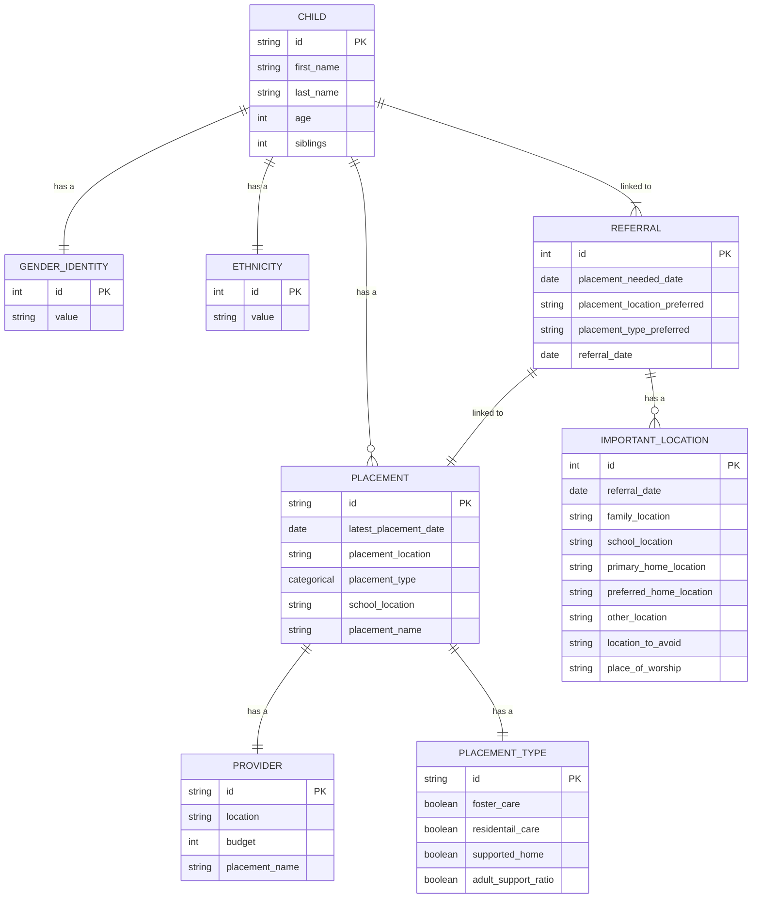

# sw-data-colletion-model

```mermaid
erDiagram
    CHILD ||--|| GENDER_IDENTITY : "has a"
    CHILD ||--|| ETHNICITY : "has a"
    CHILD ||--o{ PLACEMENT : "has a"
    PLACEMENT ||--|| PROVIDER : "has a"
    PLACEMENT ||--|| PLACEMENT_TYPE: "has a"
    REFERRAL ||--|| PLACEMENT : "linked to"
    CHILD ||--|{ REFERRAL : "linked to"
    REFERRAL ||--o{ IMPORTANT_LOCATION : "has a"
    CHILD {
        string id PK
        string first_name
        string last_name
        int age
        int siblings
    }
    ETHNICITY {
        int id PK
        string value
    }
    GENDER_IDENTITY {
        int id PK
        string value
    }
    PLACEMENT {
        string id PK
        date latest_placement_date
        string placement_location
        categorical placement_type
        string school_location
        string placement_name
    }
    PLACEMENT_TYPE {
        string id PK
        boolean foster_care
        boolean residentail_care
        boolean supported_home
        boolean adult_support_ratio
    }
    PROVIDER {
        string id PK
        string location
        int budget
        string placement_name
    }

    REFERRAL {
        int id PK
        date placement_needed_date
        string placement_location_preferred
        string placement_type_preferred
        date referral_date
    }
    IMPORTANT_LOCATION {
        int id PK
        date referral_date
        string family_location
        string school_location
        string primary_home_location
        string preferred_home_location
        string other_location
        string location_to_avoid
        string place_of_worship
    }

```

